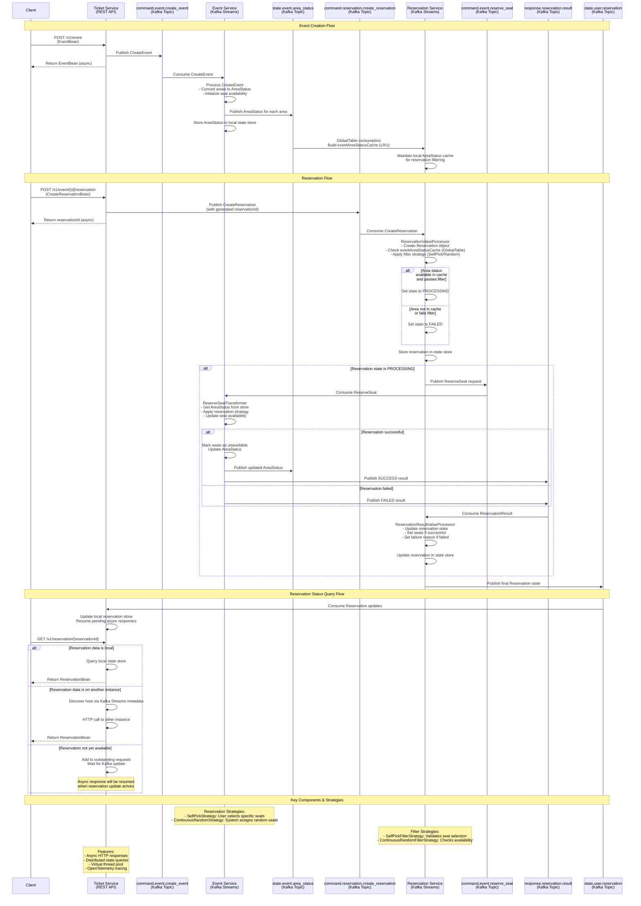

# Event Ticketing System - Sequence Flow Diagram

This diagram shows the complete flow of the event ticketing system built with Kafka Streams.

## System Overview

The system consists of three main services:
- **Ticket Service**: REST API gateway that handles HTTP requests
- **Event Service**: Manages event creation and seat reservations using Kafka Streams
- **Reservation Service**: Processes reservation requests and manages reservation state

## Mermaid Sequence Diagram

## Key Kafka Topics

| Topic | Purpose | Key | Value |
|-------|---------|-----|-------|
| `command.event.create_event` | Event creation commands | Event name | CreateEvent |
| `command.event.reserve_seat` | Seat reservation commands | eventId#areaId | ReserveSeat |
| `command.reservation.create_reservation` | Reservation creation commands | Reservation ID | CreateReservation |
| `response.reservation.result` | Reservation processing results | Reservation ID | ReservationResult |
| `state.event.area_status` | Event area status updates | eventId#areaId | AreaStatus |
| `state.user.reservation` | Final reservation states | Reservation ID | Reservation |

## State Stores

| Store | Service | Purpose | Key | Value |
|-------|---------|---------|-----|-------|
| `AreaStatus` | Event Service | Track seat availability | eventId#areaId | AreaStatus |
| `Reservation` | Reservation Service | Track reservation state | Reservation ID | Reservation |
| `eventAreaStatusCache` | Reservation Service | **GlobalTable** LRU cache (1000 entries) for filtering | eventId#areaId | AreaStatus |

## Architecture Highlights

1. **Event-Driven Architecture**: Uses Kafka topics for async communication between services
2. **CQRS Pattern**: Separate command and query responsibilities
3. **Distributed State Management**: Each service maintains its own state stores
4. **Async Processing**: Non-blocking HTTP responses with virtual threads
5. **Exactly-Once Processing**: Kafka Streams guarantees for data consistency
6. **Horizontal Scalability**: Services can be scaled independently
7. **Fault Tolerance**: Built-in retry mechanisms and error handling